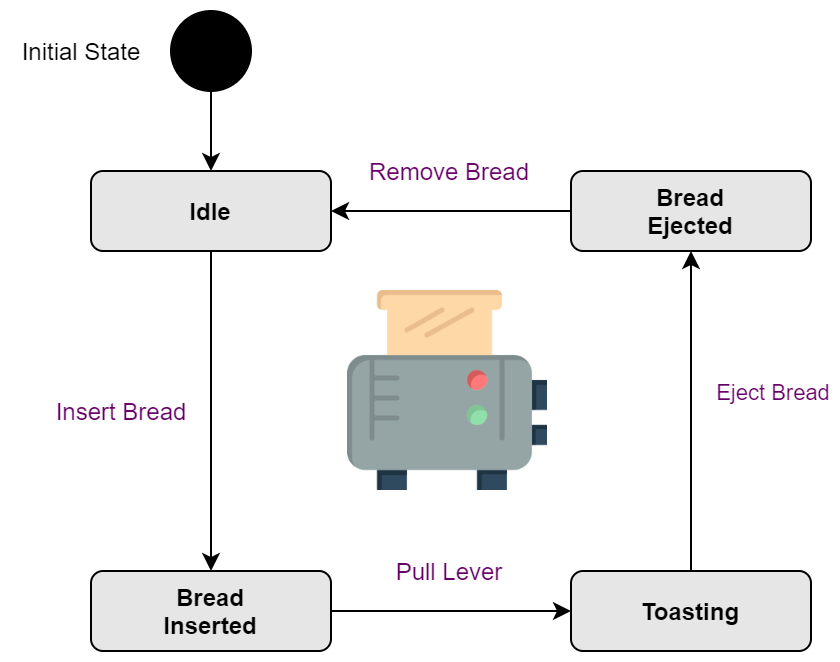

# The State Pattern Exemplified

In this article I'd like to introduce the State Pattern and show how it can be implemented in TypeScript using the example of a toaster. Along the way, I will be touching upon the concept of Finite State Machines and illustrate how the state pattern can help us with their implementation.

## State Pattern: A Behavioral Pattern to Implement State Machines

The state pattern belongs to the behavioral design patterns and thus is used to solve problems of communication and delegation. Other patterns from the same group are Observer, Visitor and Command.

Basically, what the state pattern does is encapsulate an object's internal state in order to allow it to change its behavior. This pattern is very useful when dealing with an object that can take on a multitude of clear-cut states and needs to transition between these. The encapsulation allows us to focus on one particular state at a time, keeping its behavior coherently tied to a separate class without littering up the surrounding (context) class with entagled multi-state logic.

As such, the state pattern is a very good fit for so-called finite state machines.

```
A Finite State Machine (FSM) is any kind of device that can take on exactly one of a finite set of states (= specific behaviors) at a time and allows transitioning between such states due to external input.
```

Examples of finite state machines are traffic lights (with red state, orange state, green state), ATMs (with e.g. "Insert Card" state, "Enter PIN" state) and toasters (with e.g. idle state, toasting state). The latter one shall serve as a good example to illustrate how the state pattern could be implemented.

## Toaster: A Finite State Machine

Given our defintion of a FSM above, we can capture the different states and transitions of a toaster with the help of a state diagram:



Initially, the toaster is in its `Idle` state waiting for someone to `Insert Bread`, which will make it transition into its `Bread Inserted` state. The device will remain in this state until its lever is pulled (`Pull Lever` transition), which forces it into its `Toasting` state. After a certain amount of time the bread is ejected (`Eject Bread` transition) and the toaster transitions into its `BreadEjected` state. Finally, the bread is removed (`Remove Bread` transition) and the device returns into its initial `Idle` state again.

Note that these are just the very basic states and transitions. No further behavioral logic per state (e.g. heating, cooling) is implemented, and depending on the concrete toaster model, more states and transitions exist (e.g. a timer for auto ejecting the bread).

Also note that besides the transitions given there is no other way to transition between states. Especially, there is no way to directly transition from, for example, the `Idle` state into the `Toasting` state without going through the `Bread Inserted` state.

## Implementing a Toaster in TypeScript

Let's start implementing our toaster example in TypeScript. We will begin with the definition of an interface collecting the device's operations:

```typescript
interface ToasterOperations {
    insertBread(): void
    pullLever(): void
    ejectBread(): void
    removeBread(): void
}
```

You can see that the operations of a toaster exactly match its transitions. We will now implement the `ToasterOperations` inside the `Toaster` class.

```typescript
class Toaster implements ToasterOperations {
    public insertBread(): void {
        // ...
    }
    public pullLever(): void {
        // ...
    }
    public ejectBread(): void {
        // ...
    }
    public removeBread(): void {
        // ...
    }
}
```

So far there's nothing special going on here. Next, we need to handle the action logic once a transition method is called. If we did this directly inside the `Toaster` class, we would likely end up with a lot of opaque and incoherent spaghetti code. After all, the exact behavior triggered in each method entirely depends on the current state of the `Toaster`. 

We really wouldn't want to litter the class with many `if... then... else` statements and according state logic. Instead, we will delegate the action logic that is to take place when a transition is called to the current Toaster's state itself. To do so, we will have to define different state classes (essentially encapsulating our behaviors using the state pattern) and have them implement our `ToasterOperations` interface.

We will begin with a base class `ToasterState` that other state classes will inherit from. Every distinct state is implemented in its own `State` class. The base implementation makes sure that any method called on these causes an `Error` to be thrown. After all, we don't want our `Toaster` to change state outside of our well-defined transitions. 

However, if a method is called for which a transition does exist from the curren state, no error shall be thrown. Instead, the transition should take place. To do so, we will need to override the respective transition method in a concrete subclass and the method called shall return an instance of the new `State` the toaster transitions into.

```typescript
abstract class ToasterState implements ToasterOperations
{
    public insertBread(): ToasterState {
        throw new Error("Invalid operation")
    }
    public pullLever(): ToasterState {
        throw new Error("Invalid operation")
    }
    public ejectBread(): ToasterState {
        throw new Error("Invalid operation")
    }
    public removeBread(): ToasterState {
        throw new Error("Invalid operation")
    }
}
```

For our initial `Idle` state we will implement the `IdleState` class and have it override our `insertBread()` method. When bread is inserted into the toaster, we will force it to transition into the `Bread Inserted` state, which is implemented in the `BreadInsertedState` class

```typescript
class IdleState extends ToasterState
{
    public insertBread(): ToasterState {
        return new BreadInsertedState()
    }
}
```

Likewise, we will implement the rest of our states in their respective state classes.

```typescript
class BreadInsertedState extends ToasterState
{
    public pullLever(): ToasterState {
        return new ToastingState()
    }
}

class ToastingState extends ToasterState
{
    public ejectBread(): ToasterState {
        return new BreadEjectedState()
    }
}

class BreadEjectedState extends ToasterState
{
    public removeBread(): ToasterState {
        return new IdleState()
    }
}
```

Now, all that is left for us to do is allow our `Toaster` object to change its internal state. This will be done by referencing the current state the toaster is in through a local variable. A call to any of our transition methods on the `Toaster` object is then delegated to this current `ToasterState` instance.

Thus, we will modify our 'Toaster' class as follows:

```typescript
class Toaster implements ToasterOperations
{
    // this will hold our current state and is
    // initialized with the initial state "Idle"
    private _state: ToasterState = new IdleState()

    constructor() {
        this.logCurrentState()
    }

    public insertBread(): void {
        this._state = this._state.insertBread()
        this.logCurrentState()
    }
    public pullLever(): void {
        this._state = this._state.pullLever()
        this.logCurrentState()
    }
    public ejectBread(): void {
        this._state = this._state.ejectBread()
        this.logCurrentState()
    }
    public removeBread(): void {
        this._state = this._state.removeBread()
        this.logCurrentState()
    }

    // used for testing purposes to print out the current state
    // the toaster object is in
    private logCurrentState(): void {
        console.log(this._state)
    }
}
```

We can see from the `Toaster` logic that each call to one of the transition methods will set the reference of the local `_state` variable to a new instance. Unless, of course, the transition called is currently not allowed, in which case an `Error` is thrown as per our `ToasterState` base class.

After each transition the new state is logged to the console for testing purposes.

Let's test our implementation:

```typescript
var toaster = new Toaster()
// logs: IdleState {}

toaster.insertBread()
// logs: BreadInsertedState {}

toaster.pullLever()
// logs: ToastingState {}

toaster.ejectBread()
// logs: BreadEjectedState {}

toaster.removeBread()
// logs: IdleState {}
```

This works very well. Let's see how the implementation behaves if we call a method that is currently now allowed:

```typescript
var toaster = new Toaster()
// logs: IdleState {}

toaster.ejectBread()
// logs: Error: Invalid operation
```

That's it. Our toaster is working perfectly and we have managed to keep the state logic clean and focussed by applying the state pattern.

It would be a very easy task to extend the base transitions and states without having to worry about polluting our `Toaster` class. This task, though, I will happily leave to the reader as an exercise.